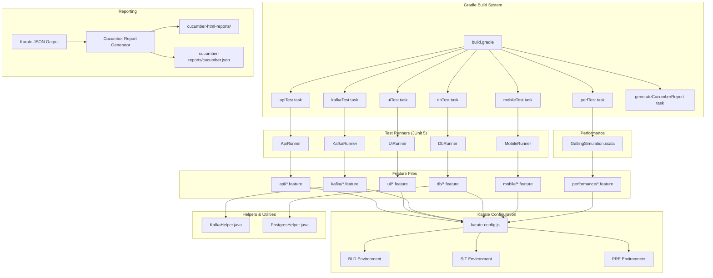

# Design Document: Karate Test Framework

## Overview

This design describes a greenfield Gradle-based Karate test automation framework that provides a unified solution for API, UI, Kafka, database, mobile, and performance testing. The framework uses Karate 1.4.x as the core test engine, integrates Gatling for performance testing, and generates Cucumber HTML and JSON reports for human review and Xray import.

The project is structured as a single Gradle project with clearly separated directories per test type, shared helper utilities for Kafka and Postgres, environment-aware configuration via `karate-config.js`, and dedicated JUnit 5 runner classes for each test category. Gradle tasks provide one-command execution for each test type with environment selection via `-Dkarate.env`.

### Key Design Decisions

1. **Karate 1.4.1** — Stable release with full support for API, UI (browser automation), and Gatling integration. Requires Java 11+.
2. **Gradle with Groovy DSL** — Widely adopted, simpler syntax for build configuration compared to Kotlin DSL for this use case.
3. **JUnit 5 runners** — Each test type gets its own runner class, enabling Gradle task filtering by test class.
4. **net.masterthought cucumber-reporting** — Mature library that generates both HTML and JSON Cucumber reports from Karate's output.
5. **Scala-based Gatling simulation** — Karate-Gatling integration requires Scala simulation classes; the Gradle build includes the Scala plugin for compilation.
6. **Java helper classes** — KafkaHelper and PostgresHelper are plain Java classes callable from Karate feature files via `Java.type()`.

## Architecture



### Execution Flow

1. Engineer runs a Gradle task (e.g., `./gradlew apiTest -Dkarate.env=SIT`)
2. Gradle invokes the corresponding JUnit 5 runner class
3. The runner discovers and executes feature files in the target directory
4. `karate-config.js` initializes environment-specific variables based on `karate.env`
5. Feature files use config variables for URLs, connection strings, and broker addresses
6. Karate produces JSON result files in `build/karate-reports/`
7. The `generateCucumberReport` task processes JSON output into Cucumber HTML and JSON reports

## Components and Interfaces

### 1. build.gradle

The central build script that declares all plugins, dependencies, source sets, and tasks.

**Plugins:**
- `java` — Java compilation
- `scala` — Scala compilation for Gatling simulation classes
- `io.gatling.gradle` (version 3.9.5.x) — Gatling integration

**Dependencies:**

| Dependency | Group | Version | Scope |
|---|---|---|---|
| karate-core | io.karatelabs | 1.4.1 | test |
| karate-junit5 | io.karatelabs | 1.4.1 | test |
| karate-gatling | io.karatelabs | 1.4.1 | test |
| kafka-clients | org.apache.kafka | 3.6.1 | test |
| postgresql | org.postgresql | 42.7.1 | test |
| cucumber-reporting | net.masterthought | 5.7.7 | test |

**Source Sets:**
- `src/test/java` — Runner classes and helper utilities
- `src/test/resources` — Feature files and `karate-config.js`
- `src/test/scala` — Gatling simulation classes

**Tasks:**
Each test type task is a `Test` type task that filters by the corresponding runner class:

```groovy
task apiTest(type: Test) {
    include '**/ApiRunner.class'
    systemProperty 'karate.env', System.getProperty('karate.env', 'BLD')
}
```

The `generateCucumberReport` task runs after test tasks to produce HTML and JSON reports.

### 2. karate-config.js

Located at `src/test/resources/karate-config.js` (test classpath root).

**Interface:** Returns a configuration object with environment-specific properties.

```javascript
function fn() {
    var env = karate.env || 'BLD';
    var config = { env: env };

    if (env === 'BLD') {
        config.baseUrl = 'https://api.bld.example.com';
        config.uiBaseUrl = 'https://app.bld.example.com';
        config.dbUrl = 'jdbc:postgresql://db.bld.example.com:5432/testdb';
        config.dbUser = 'test_user';
        config.dbPassword = 'test_pass';
        config.kafkaBrokers = 'kafka.bld.example.com:9092';
        config.mobileAppId = 'com.example.app.bld';
    } else if (env === 'SIT') {
        // SIT-specific values
    } else if (env === 'PRE') {
        // PRE-specific values
    } else {
        throw new Error('Unsupported environment: ' + env + '. Valid: BLD, SIT, PRE');
    }

    return config;
}
```

**Exposed Properties:** `baseUrl`, `uiBaseUrl`, `dbUrl`, `dbUser`, `dbPassword`, `kafkaBrokers`, `mobileAppId`

### 3. Runner Classes

Each runner is a JUnit 5 class annotated with `@Karate.Test` that targets a specific feature directory.

| Runner | Package | Target Path |
|---|---|---|
| ApiRunner | runners | classpath:api |
| UiRunner | runners | classpath:ui |
| KafkaRunner | runners | classpath:kafka |
| DbRunner | runners | classpath:db |
| MobileRunner | runners | classpath:mobile |

**Interface pattern:**

```java
package runners;

import com.intuit.karate.junit5.Karate;

class ApiRunner {
    @Karate.Test
    Karate testApi() {
        return Karate.run("classpath:api").relativeTo(getClass());
    }
}
```

### 4. KafkaHelper.java

**Package:** `helpers`

**Public Methods:**

| Method | Parameters | Returns | Description |
|---|---|---|---|
| `produce` | `String brokers, String topic, String key, String value` | `void` | Sends a message to the specified Kafka topic |
| `consume` | `String brokers, String topic, String groupId, int timeoutMs` | `List<Map<String, Object>>` | Consumes messages from a topic within the timeout period |

**Behavior:**
- Creates a `KafkaProducer` / `KafkaConsumer` per invocation with string serializers/deserializers
- The `consume` method polls until timeout, collecting all available messages
- Throws `RuntimeException` with descriptive message if broker is unreachable
- Closes producer/consumer in a `finally` block to prevent resource leaks

**Karate Integration:** Called from feature files via:
```gherkin
* def KafkaHelper = Java.type('helpers.KafkaHelper')
* KafkaHelper.produce(kafkaBrokers, 'test-topic', 'key1', '{"msg":"hello"}')
```

### 5. PostgresHelper.java

**Package:** `helpers`

**Public Methods:**

| Method | Parameters | Returns | Description |
|---|---|---|---|
| `query` | `String dbUrl, String user, String password, String sql` | `List<Map<String, Object>>` | Executes a SELECT and returns rows as list of maps |
| `execute` | `String dbUrl, String user, String password, String sql` | `int` | Executes INSERT/UPDATE/DELETE and returns affected row count |

**Behavior:**
- Creates a JDBC connection per invocation using `DriverManager.getConnection()`
- The `query` method iterates `ResultSet` and builds `List<Map<String, Object>>` from column metadata
- Throws `RuntimeException` with descriptive message if connection fails
- Closes connection, statement, and result set in a `finally` block

**Karate Integration:** Called from feature files via:
```gherkin
* def DbHelper = Java.type('helpers.PostgresHelper')
* def result = DbHelper.query(dbUrl, dbUser, dbPassword, 'SELECT * FROM users WHERE id = 1')
```

### 6. Gatling Simulation

**File:** `src/test/scala/performance/ApiPerformanceSimulation.scala`

**Interface:**
- Extends `Simulation` (Gatling base class)
- Uses `karateProtocol` to wrap Karate feature files
- Configures user injection profile (concurrent users, ramp-up duration)
- Reads environment from system property

```scala
class ApiPerformanceSimulation extends Simulation {
    val protocol = karateProtocol()
    val apiTest = scenario("API Performance")
        .exec(karateFeature("classpath:performance/perf-api.feature"))

    setUp(
        apiTest.inject(rampUsers(10).during(30))
    ).protocols(protocol)
}
```

### 7. Cucumber Report Generator

**Approach:** A custom Gradle task that invokes `net.masterthought.cucumber.ReportBuilder` programmatically after test execution.

**Inputs:** Karate JSON output files from `build/karate-reports/`
**Outputs:**
- HTML reports → `target/cucumber-html-reports/`
- JSON report → `target/cucumber-reports/cucumber.json`

The task collects all `*.json` files from Karate's output directory, feeds them to `ReportBuilder`, and configures it to produce both HTML and JSON output. The JSON output follows the standard Cucumber JSON format compatible with Xray import.

## Data Models

### Environment Configuration Object

```
KarateConfig {
    env: String              // "BLD" | "SIT" | "PRE"
    baseUrl: String          // API base URL
    uiBaseUrl: String        // UI application URL
    dbUrl: String            // JDBC connection string
    dbUser: String           // Database username
    dbPassword: String       // Database password
    kafkaBrokers: String     // Kafka broker addresses
    mobileAppId: String      // Mobile app package/bundle ID
}
```

### Kafka Message Model

```
KafkaMessage {
    topic: String
    key: String
    value: String            // JSON string payload
    partition: int
    offset: long
    timestamp: long
}
```

### Database Query Result

```
QueryResult = List<Map<String, Object>>
// Each map represents a row with column names as keys
// Example: [{"id": 1, "name": "Alice"}, {"id": 2, "name": "Bob"}]
```

### Cucumber JSON Report Structure

```
CucumberReport = List<Feature>

Feature {
    uri: String
    name: String
    elements: List<Scenario>
}

Scenario {
    name: String
    type: String             // "scenario"
    steps: List<Step>
}

Step {
    name: String
    keyword: String          // "Given", "When", "Then"
    result: StepResult
}

StepResult {
    status: String           // "passed" | "failed" | "skipped"
    duration: long           // nanoseconds
    error_message: String    // present only on failure
}
```

## Project Directory Structure

```
karate-test-framework/
├── build.gradle
├── settings.gradle
├── gradlew
├── gradlew.bat
├── gradle/
│   └── wrapper/
│       ├── gradle-wrapper.jar
│       └── gradle-wrapper.properties
├── README.md
├── src/
│   └── test/
│       ├── java/
│       │   ├── runners/
│       │   │   ├── ApiRunner.java
│       │   │   ├── UiRunner.java
│       │   │   ├── KafkaRunner.java
│       │   │   ├── DbRunner.java
│       │   │   └── MobileRunner.java
│       │   └── helpers/
│       │       ├── KafkaHelper.java
│       │       └── PostgresHelper.java
│       ├── scala/
│       │   └── performance/
│       │       └── ApiPerformanceSimulation.scala
│       └── resources/
│           ├── karate-config.js
│           ├── logback-test.xml
│           ├── api/
│           │   └── api-sample.feature
│           ├── ui/
│           │   └── ui-sample.feature
│           ├── kafka/
│           │   └── kafka-sample.feature
│           ├── db/
│           │   └── db-sample.feature
│           ├── mobile/
│           │   └── mobile-sample.feature
│           └── performance/
│               └── perf-api.feature
├── target/
│   ├── cucumber-html-reports/    (generated)
│   └── cucumber-reports/
│       └── cucumber.json         (generated)
└── build/
    └── karate-reports/           (generated by Karate)
```


## Error Handling

### karate-config.js — Invalid Environment

When an unsupported environment value is provided, `karate-config.js` throws a JavaScript `Error` with the message:
```
Unsupported environment: <value>. Valid options: BLD, SIT, PRE
```
This causes Karate to fail immediately before any scenario executes, providing clear feedback.

### KafkaHelper — Connection Failures

- If the Kafka broker is unreachable, `KafkaHelper.produce()` and `KafkaHelper.consume()` catch the underlying `KafkaException` and rethrow as a `RuntimeException` with message: `Failed to connect to Kafka broker at <brokers>: <original message>`
- The `consume()` method returns an empty list if no messages are available within the timeout (not an error condition)
- Producer and consumer are always closed in `finally` blocks regardless of success or failure

### PostgresHelper — Connection and Query Failures

- If the database connection fails, both `query()` and `execute()` catch `SQLException` and rethrow as `RuntimeException` with message: `Failed to connect to database at <dbUrl>: <original message>`
- If a SQL query is malformed, the `SQLException` is wrapped with: `SQL execution failed: <original message>`
- Connection, statement, and result set are always closed in `finally` blocks to prevent resource leaks

### Gatling Simulation — Feature File Errors

- If a Karate feature file fails during a Gatling simulation, Gatling records the failure in its report with the error details
- The simulation continues executing remaining iterations; individual failures do not abort the entire load test
- The Gatling HTML report shows pass/fail breakdown per request

### Cucumber Report Generation — Missing Input

- If no Karate JSON output files exist in `build/karate-reports/`, the report generation task logs a warning and skips report creation rather than failing the build
- If JSON files are malformed, `ReportBuilder` logs the parsing error and excludes those files from the report

## Testing Strategy

### Approach

Since this project is a **test framework scaffolding** — consisting of build configuration, environment config, example test files, helper utilities, and documentation — property-based testing is not applicable. The deliverables are:

- **Declarative configuration** (build.gradle, karate-config.js) — validated by compilation and smoke tests
- **Example test files** (.feature files) — these ARE the tests; they validate themselves when executed
- **I/O wrapper classes** (KafkaHelper, PostgresHelper) — thin wrappers around external service clients, best validated with integration tests
- **Runner classes** — boilerplate JUnit wiring, validated by successful test execution
- **Documentation** (README) — validated by manual review

There are no pure functions with large input spaces or universal properties that would benefit from property-based testing.

### Validation Strategy by Component

| Component | Validation Method | Details |
|---|---|---|
| build.gradle | Smoke test | `./gradlew build` compiles without errors; all tasks are defined |
| karate-config.js | Example-based test | Feature file that reads config values for each environment and validates they are set |
| API feature file | Self-validating | Execute `./gradlew apiTest` against a live or mock endpoint |
| UI feature file | Self-validating | Execute `./gradlew uiTest` against a running web application |
| Kafka feature file | Integration test | Execute `./gradlew kafkaTest` against a running Kafka broker |
| DB feature file | Integration test | Execute `./gradlew dbTest` against a running Postgres instance |
| Mobile feature file | Integration test | Execute `./gradlew mobileTest` against a device/emulator |
| KafkaHelper | Integration test | Produce and consume a message against a real or containerized Kafka broker |
| PostgresHelper | Integration test | Execute queries against a real or containerized Postgres instance |
| Gatling simulation | Performance test | Execute `./gradlew perfTest` and verify Gatling report generation |
| Cucumber reports | Smoke test | Run any test task, then verify HTML and JSON reports exist in expected directories |
| README | Manual review | Verify commands listed in README match actual Gradle task names |

### Test Execution Commands

```bash
# Run all tests for a specific type
./gradlew apiTest -Dkarate.env=BLD
./gradlew uiTest -Dkarate.env=SIT
./gradlew kafkaTest -Dkarate.env=PRE
./gradlew dbTest
./gradlew mobileTest
./gradlew perfTest

# Generate Cucumber reports after test execution
./gradlew generateCucumberReport

# Run with environment selection
./gradlew apiTest -Dkarate.env=SIT
```

### Continuous Integration Considerations

- The framework itself is validated by successful compilation (`./gradlew build`)
- Individual test types require their respective external services to be available
- CI pipelines should run `apiTest` against mock services for framework validation
- Cucumber JSON reports can be uploaded to Xray via the Xray REST API as a post-test CI step
